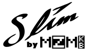

# SlimDash

ErgoDash inspired low-profile key switch keyboard with embedded RP2040

## Features

* Ortho-Staggered Split keyboard layout
* Slim body (20-22mm depending on key caps and rubber feet used)
* Rigid body structure
* Per-Key RGB LED Matrix lighting
* USB-C connector
* Easy build utilizing PCBA service
  * Hand Soldering needed:
    * 70 x Kailh choc v1 hotswap sockets
    * 4 x tactile switches (2 x BOOT is optional)
    * 2 x trrs jack
    * 70 SK6812MINI-E (optional for RGB matrix)
  * Assembly
    * Just PH001 Philips screws necessary

### Variations

Currently there is only one variation.

* SlimDash rev.1
  * See the [readme](./hardware-rev1/README.md) in the hardware-rev1
    directory for build instructions.
  * For firmware, see [here](./firmware/keyboards/mzmkb/slimdash/readme.md)

### TODOs

* Open PR to qmk-firmware and vial-qmk repos.
  * check if vial-qmk PR should wait for upstream RGB related changes to land?

## Acknowlegements

* [ErgoDash by omkbd](https://github.com/omkbd/ErgoDash)
  * Inspiration for this keyboard
* [ergogen](https://github.com/ergogen/ergogen)
  * Tooling to assist in the key layout and mechanical design
* Tutorials to get me started with ergogen
  * [Let's Design A Keyboard With Ergogen v4](https://flatfootfox.com/ergogen-part2-outlines/)
  * [I Built My Dream Keyboard from Absolute Scratch](https://www.youtube.com/watch?v=7UXsD7nSfDY)
* Tools used for making `keyboard.json` _less_ tedious.
  * [KLE](https://www.keyboard-layout-editor.com/)
  * [Keyboard Firmware Builder](https://kbfirmware.com/)
  * [KBFirmware to qmk converter](https://noroadsleft.github.io/kbf_qmk_converter/)

## License

[SlimDash](https://github.com/mizma/SlimDash) by
[mizma](https://github.com/mizma) is licensed under
[Creative Commons Attribution-ShareAlike 4.0 International](https://creativecommons.org/licenses/by-sa/4.0/?ref=chooser-v1)
 -
 -

