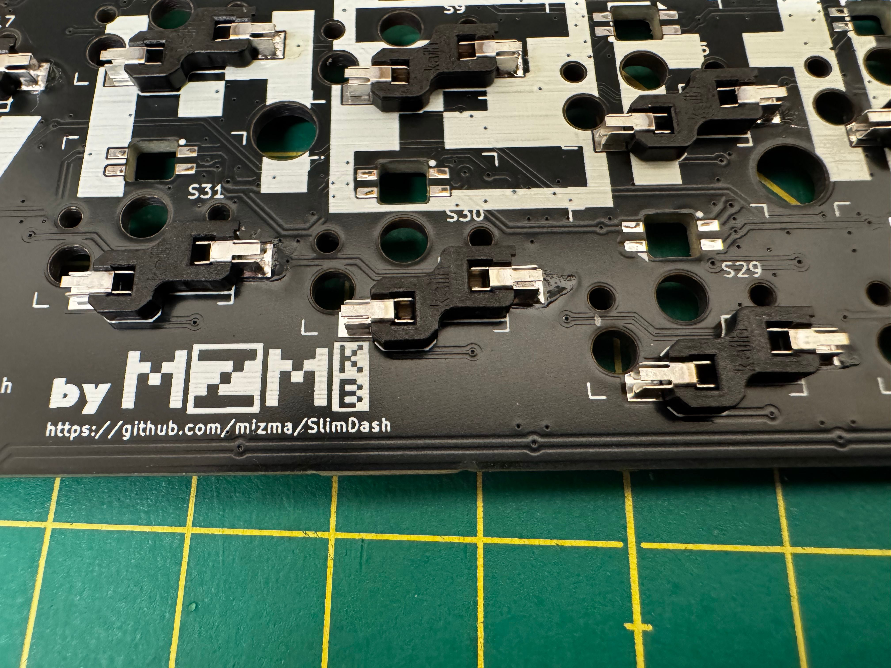

# hardware-rev1 Build Instructions

## Parts List (for one keyboard)

* PCB
  * Order with PCBA using ./hardware-rev1/PCB/slimdash_v1.0.0.zip and
    BOM/CPL files in the same directory.
  * You will need 2 PCBs for one set of keyboard
  * Ordering Instructions below.
* Acrylic: Order cuts for following (number required for one keyboard)
  * `backplate_1left_3mm-157.1x131.2.zip` x 1
  * `backplate_1right_3mm-155.2x131.2.zip` x 1
  * `backplate_2both_2mm-157.1x131.2.zip` x 1
  * `backplate_2left_2mm-157.1x131.2.zip` x 1
  * `backplate_3both_2mm-157.1x39.02.zip` x 2
  * `baseplate_left_2mm-155.2x131.2.zip` x 1
  * `baseplate_right_2mm-155.2x131.2.zip` x 1
  * `coverplate_both_2mm-20.05x81.60.zip` x 2
  * Ordering Instructions below.
* Screws/standoff
  * 14x m2x4 through-hole standoff x 7 x 2 = 14
    * <https://www.monotaro.com/p/1111/2876/>
  * 6x m2x10 through-hole standoff x 3 x 2 = 6
    * <https://www.monotaro.com/p/1111/2998/>
  * 32x m2x4 screws x (10 + 6) x 2 = 32
    * <https://www.monotaro.com/p/2902/9395/>
  * 8x m2x6 screws x 4 x 2 = 8
    * <https://www.monotaro.com/p/2902/9413/>
* Hand-Soldered Items
  * 70x Kailh low profile (choc v1) switches of your choice
  * 70x Kailh low profile hotswap sockets
    * Can be ordered from LCSC with part number [C5333465](https://www.lcsc.com/product-detail/Mechanical-Keyboard-Shaft_Kailh-CPG135001S30_C5333465.html)
  * 4x 3x6x4.3 horizontal tact switch
    * <https://shop.yushakobo.jp/collections/all-keyboard-parts/products/a1600ed-01-1>
    * You can also order from LCSC with part number [C18078123](https://www.lcsc.com/product-detail/Tactile-Switches_Bossie-BX-TS-26-3643ZJ_C18078123.html)
    * MJTP1117/PHAP3363 from DigiKey should work as well [679-2400-ND](https://www.digikey.com/en/products/detail/apem-inc/MJTP1117/1795496)
    * [schematics](images/tactile-switch_3x6x4.3.jpg)
  * 2x TRRS socket (MJ-4PP-9) connector
    * <https://shop.yushakobo.jp/products/a0800tr-01-1>
  * (optional) 70x SK6812MINI-E
    * <https://shop.yushakobo.jp/products/sk6812mini-e-10?variant=40047782953121>
    * [C5149201](https://www.lcsc.com/product-detail/RGB-LEDs-Built-in-IC_OPSCO-Optoelectronics-SK6812MINI-E_C5149201.html)
* A Kailh Choc v1 compatible keycap set
  * recommend ortho linear keycap set (some examples below)
  * [MBK Legend Glow R2](https://fkcaps.com/keycaps/mbk/legend-glow)
  * [Chosfox CFX](https://chosfox.com/collections/keycaps)
* Other Accessories
  * 1x TRRS Cable (Straight)
    * <https://shop.yushakobo.jp/products/self-made-cable?variant=39623339737249>
    * Anything with Tip-Ring-Ring-Sleeve type 2.5mm jack with straight wiring
      should work.
  * 1x USB-C Cable (Type-A to C or Type-C to C depending on your host PC connector)
  * 8x Rubber feet stickers

### PCB Ordering Instructions (JLCPCB)

1. Go to [JLCPCB](https://jlcpcb.com/jp/)
2. In the "Upload Gerber File" select the `./PCB/slimdash_v1.0.0.zip` file.
3. In the order settings, select the following options.
    * Base Material: FR-4
    * Layers: 2
    * Dimensions: Automatically filled in. __DON'T TOUCH__
    * PCB order volume: your choice
    * Product type: Industrial/Consumer Electronics
    * Alternate Designs: 1
    * Panilization: No Panilization
    * PCB Thickness: 1.6mm
    * PCB Color: your choice
    * Silkscreen: your choice
    * Surface Finish: your choice (HASL is fine)
    * Copper Thickness: 1 oz
    * Via: Resist Cover
    * Minimum via diameter: Keep default
    * PCB dimension tolerance: Keep default
    * Check Manufacturing data: your choice
    * PCB marking: remove marking
    * Electrical Test: Keep default
    * Card Edge connector: No
    * Castelated through-hole: No
    * Edge Plating: No
4. Select PCB Assembly option
    * PCBA Type: Economic
    * Assembly side: Top side
    * PCBA volume: same as PCB order volume (unless you are going to
      hand-solder SMT packages)
    * Tooling Hole: Added by Customer
    * Part Placement check: Yes
    * Part Selection: By Customer
    * Other Detail options: your choice.  Read JLCPCB descriptions carefully.
5. Go to next and Upload the [BOM](./PCB/bom.csv) file and [CPL](./PCB/CPL.csv) file
6. Check that the layout of the PCB has no errors. (It should look like the following)
    * 
7. Go to Quote and Order.

### Acrylic Ordering Instructions

1. Go to [Elecrow](https://www.elecrow.com/acrylic-cutting.html)
2. Upload each zip files in the Acrylic folder to order
    * Dimensions and Thickness should match the dimensions in the .zip file name.
      * i.e. for backplate_1left_3mm-157.1x131.2.zip, width x heigh should be 157.1x131.2
        and thickness of 3mm
    * Qty can be any number you require.
    * Color can be anything, but 2mm thickness only support Transparent, black or white.

## Assembly Instructions

First, solder the 90 degree tactile switch to the RST and BOOT.

The switch should be implemented on the top side for each hand.
Picture above shows the left hand side implementation.

Tact switch should be soldered before the TRRS jack.  TRRS jack
is then soldered on the same side of the board as the tactile
switches.

Once both the Tactile switches and the TRRS jack is implemented,
it should look like the following for left and right hand side.

After the TRRS and Tactile switches, apply pre-solder to one side of
the pad of each choc v1 hotswap sockets as shown below.

This pre-solder must be done on the opposite side from the tactile switches and
TRRS jacks.

After pre-solder is applied, place the hotswap sockets in place, and
use the soldering iron to pre-fuse the socket onto the pad.

Once the sockets are held in place, apply solder to the other side for
proper soldering, and then apply extra solder on the pre-fused side to
secure the socket in place.

When applying solder to the socket, make sure you do not over-apply solder.
If the solder bulges beyond the pad area (surpassing the yellow line in Picture
below), the acrylic will interfere and will not assemble properly.

If the solder interferes with the acrylic, don't force the assembly and remove
some solder using solder wick.

__OPTIONAL__: you may solder the SK6812MINI-E RGB LEDs at this point if you would
like.  See section below for extra instructions.

After Sockets are soldered, place the backplate on the front side and insert
the kailh choc v1 keyswitches of your choice.  After all the switches are inserted,
place the 4mm long M2 spacer (standoff) from the back side, and loosely secure it
with the 4mm long M2 screws.

Flip the board to the back, place the backplate 1 ~ 3 and screw in the
4mm and 6mm screws. 6mm screws are used for the screw holes that go
through backplate 3.

After backplate is assembled, place the 10mm M2 spacer in the MCU areas
3 holes, and secure them with M2 screws, placing the coverplate on the top.
Put your choice of key caps.

You may apply rubber feet stickers on the back side for better stability and
stop the keyboard from sliding around in use.

### RGB Instructions

You will need to first jump the `JP1` solder jumper right next to the TRRS Jack.

Then solder the SK6812MINI-E from the back of the PCB, with the light emitting
side facing up.

See the pictures for the correct orientation (PIN1 is marked with yellow dot).

Note: the pin that has a diagonal cut is NOT PIN1.  Diagonal cut pin is diagonally
opposite from PIN1 marked on the picture above with yellow dot.

[SK6812MINI-E schematic](./Assets/SK6812MINI_E_Schematics.jpg)
