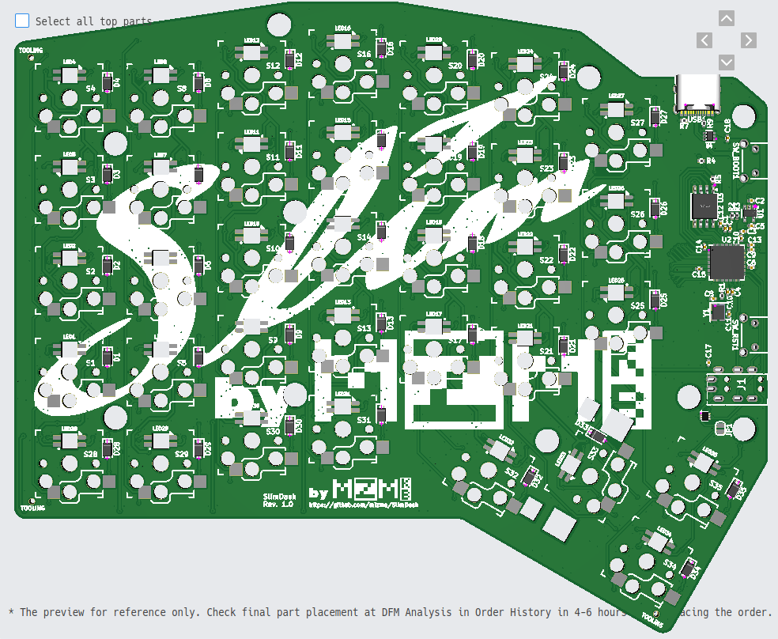
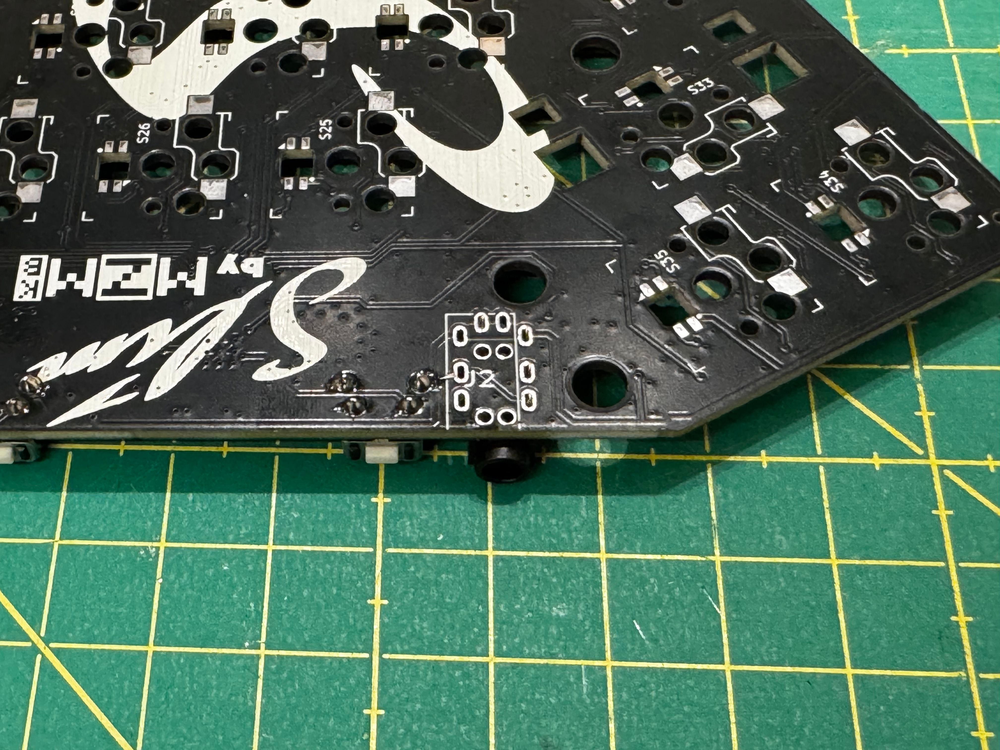
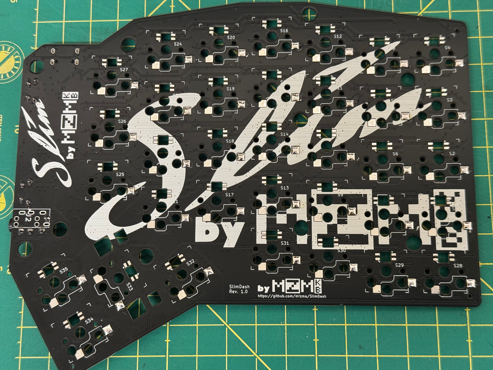
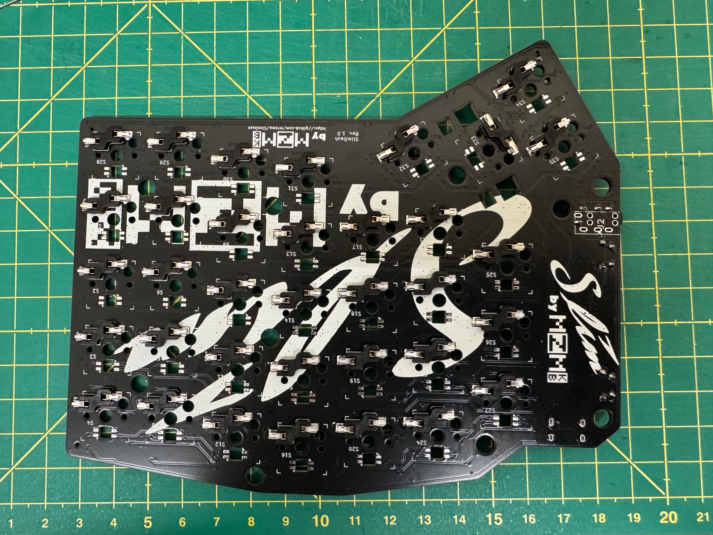
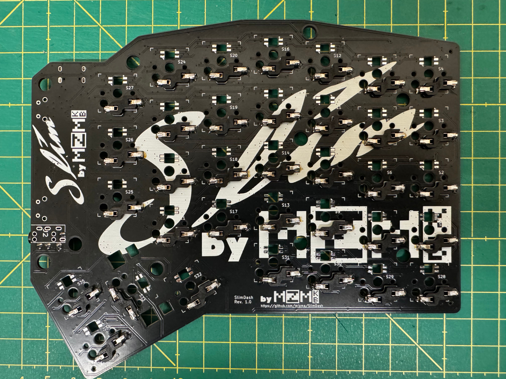
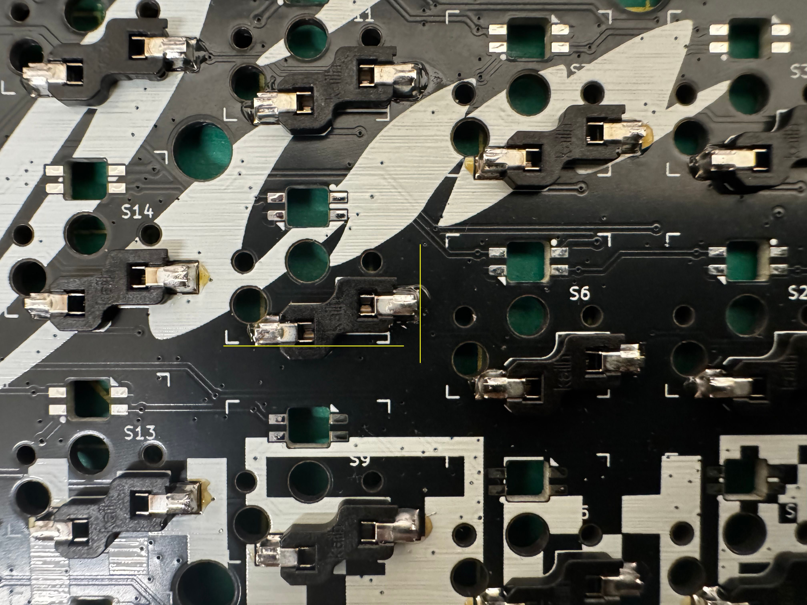
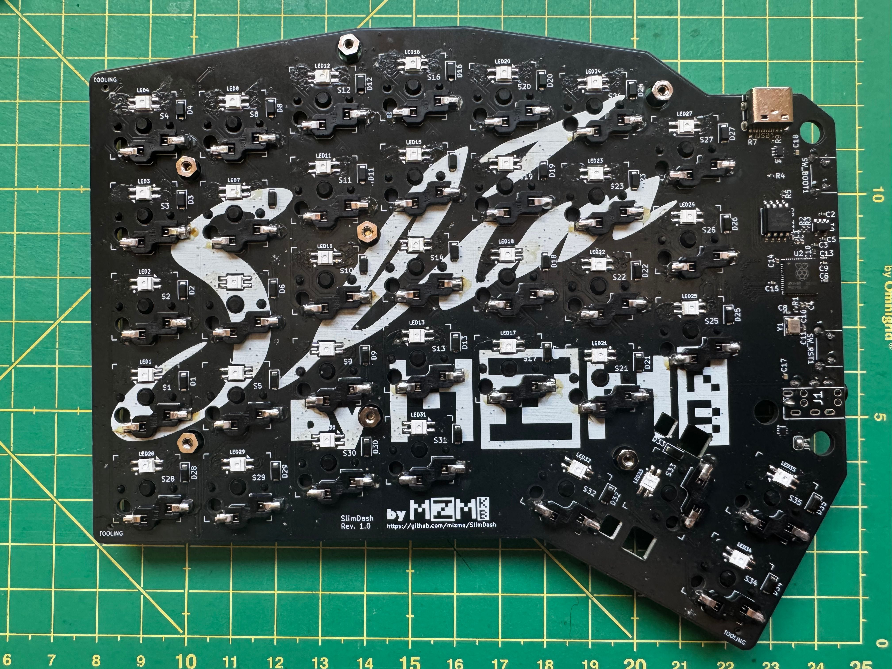
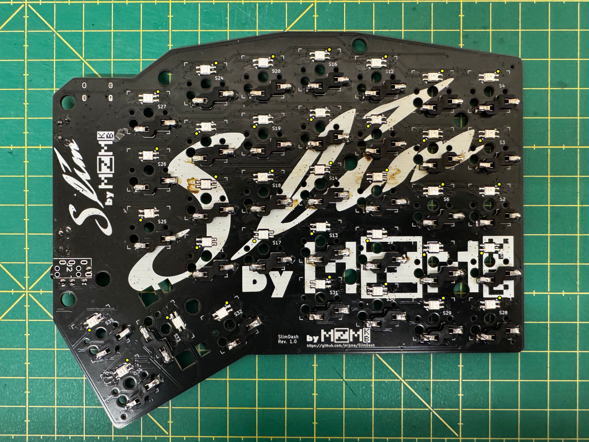

# hardware-rev1 組み立て手順

__重要__ 一旦この組み立て手順を一通り通しで確認し、全体的な流れと
どうなるかを把握してから組み立てを開始することを強く推奨します。

## パーツリスト（１セット分）

* 基板（PCB）
  * 基板実装の発注は ./hardware-rev1/PCB/slimdash_v1.0.0.zip と、
    同一フォルダにある BOM/CPL ファイルを使って発注してください
  * キーボード１セットに同一の基板が２枚必要になります
  * 発注方法詳細は後続のセクションで説明します
* アクリル筐体: 以下のファイルでのアクリルカットを発注
  （キーボード１セットに必要な枚数も以下に記載）
  * `backplate_1left_3mm-157.1x131.2.zip` x 1
  * `backplate_1right_3mm-155.2x131.2.zip` x 1
  * `backplate_2both_2mm-157.1x131.2.zip` x 1
  * `backplate_2left_2mm-157.1x131.2.zip` x 1
  * `backplate_3both_2mm-157.1x39.02.zip` x 2
  * `baseplate_left_2mm-155.2x131.2.zip` x 1
  * `baseplate_right_2mm-155.2x131.2.zip` x 1
  * `coverplate_both_2mm-20.05x81.60.zip` x 2
  * 発注方法詳細は後続のセクションで説明します
* スペーサー及びネジ
  * 14x m2x4 両メネジ貫通スペーサー x 7 x 2 = 14
    * <https://www.monotaro.com/p/1111/2876/>
  * 6x m2x10 両メネジスペーサー x 3 x 2 = 6
    * <https://www.monotaro.com/p/1111/2998/>
  * 32x m2x4 ネジ x (10 + 6) x 2 = 32
    * <https://www.monotaro.com/p/2902/9395/>
  * 8x m2x6 ネジ x 4 x 2 = 8
    * <https://www.monotaro.com/p/2902/9413/>
* 手ハンダ部品
  * 70x Kailh ロープロファイル (choc v1) スイッチ（軸は好みで選択可）
    * <https://shop.yushakobo.jp/collections/all-switches/Kailh-Choc-V1%E3%82%B9%E3%82%A4%E3%83%83%E3%83%81>
  * 70x Kailh ロープロファイル ホットスワップソケット
    * <https://shop.yushakobo.jp/products/a01ps?variant=37665172553889>
    * LSCSで [C5333465](https://www.lcsc.com/product-detail/Mechanical-Keyboard-Shaft_Kailh-CPG135001S30_C5333465.html)で発注可能
  * 4x 3x6x4.3 水平タクタイルスイッチ
    * <https://shop.yushakobo.jp/collections/all-keyboard-parts/products/a1600ed-01-1>
    * LCSCで [C18078123](https://www.lcsc.com/product-detail/Tactile-Switches_Bossie-BX-TS-26-3643ZJ_C18078123.html) で発注可能
    * [schematics](images/tactile-switch_3x6x4.3.jpg)
  * 2x TRRS ソケット (MJ-4PP-9)
    * <https://shop.yushakobo.jp/products/a0800tr-01-1>
  * (オプション) 70x SK6812MINI-E
    * <https://shop.yushakobo.jp/products/sk6812mini-e-10?variant=40047782953121>
    * [C5149201](https://www.lcsc.com/product-detail/RGB-LEDs-Built-in-IC_OPSCO-Optoelectronics-SK6812MINI-E_C5149201.html)
* Kailh Choc v1 互換のキーキャップセット
  * Ortho-Linear 系のキーキャップセット推奨 (以下例)
  * [MBK Legend Glow R2](https://fkcaps.com/keycaps/mbk/legend-glow)
  * [Chosfox CFX](https://chosfox.com/collections/keycaps)
* その他部品
  * 1x TRRS ケーブル (ストレート配線)
    * <https://shop.yushakobo.jp/products/self-made-cable?variant=39623339737249>
    * Tip-Ring-Ring-Sleeve 形式の４線ストレート配線の2.5mmジャックであれば利用可能
  * 1x USB-C ケーブル (PC側のコネクタに合わせてType-A-Type-C か Type-C-Type-Cを選択)
  * 8x 滑り止めゴム足ステッカー
    * 100斤等で購入可能

### 基板発注手順 (JLCPCB)

1. ブラウザで[JLCPCB](https://jlcpcb.com/jp/)を開く
2. ガーバーファイルをアップロードから`./PCB/slimdash_v1.0.0.zip`をアップロード
3. 発注オプションで以下を選択
    * ベース素材: FR-4
    * 層: 2
    * 寸法: 自動入力 __変更しないこと__
    * PCB数量: 必要な分だけ選択
    * 製品タイプ: 工業用/民生用電子機器
    * 異なるデザイン: 1
    * 納品形式: 面付け無し
    * PCB厚さ: 1.6mm
    * PCBカラー: 好みで選択
    * シルクスクリーン印刷: 好みで選択
    * 表面仕上げ: 好みで選択 (HASLで基本問題ありません)
    * 外層銅箔厚み: 1 oz
    * ビア処理: レジストカバー
    * 最小ビア内径/外径: デフォルトのまま
    * 基板外形の公差: デフォルトのまま
    * 製造用ファイルの事前確認: 好みで選択
    * PCB上のマーク: マーク除去
    * 電気テスト: デフォルトのまま
    * 金端子/カードエッジコネクタ: いいえ
    * 端面スルーホール: いいえ
    * エッジメッキ: いいえ
4. PCB組み立てをON
    * PCBAタイプ: エコノミック
    * 組立サイド: トップ面
    * PCBA数量: SMT部品を手ハンダしない限りはPCB発注数と同じ
    * ツーリングホール: お客様に追加される
    * 部品配置の確認: はい
    * 部品の選択: お客様により
    * その他詳細オプション: 必要に応じて選択。基本デフォルトで問題ありません
5. 次へを選択し [BOM](./PCB/bom.csv) ファイルと [CPL](./PCB/CPL.csv) ファイルをアップロード
6. 部品配置に異常がないか確認 (概ね以下の画像のようになるはずですが、JLCPCB側の設定変更等で
   合わなくなる場合があるため、その場合はGithubでIssueを発行いただくか、配置の修正を検討してください)
    * 
7. 見積もりと発注を選択し発注

### アクリルカットの発注手順

1. ブラウザで[Elecrow](https://www.elecrow.com/acrylic-cutting.html)を開く
2. Acrylicフォルダにあるzipファイルをアップロードして必要数分発注
    * サイズと発注に設定するべき厚みはファイル名に記載されている通り設定します
      * 例： backplate_1left_3mm-157.1x131.2.zip の場合 width x height は 157.1x131.2
        で、厚みは3mmになります。
    * 発注数は必要数分発注してください。
    * カラーは好きなカラーを選択できますが、2mmの厚みは発注可能な色に制限があるため注意。
      * 2mmの厚みのパーツを3mm以上で発注しても問題ありませんが、その場合はネジの長さや
        スペーサーの長さを合わせて変更する必要があります。

## 組み立て手順

まず最初に SW_RST1とSW_BOOT1のタクタイルスイッチをはんだ付けします。

基板をそれぞれ左右のキーボードの方向にした場合にスイッチが基板上面
に来るように取り付けます（左右でそれぞれ反対側にスイッチが実装されます）
上の画像では左手側の実装面での例となります。

タクタイルスイッチはTRRSジャックより先にはんだ付けしてください。
TRRSジャックを先に取り付けるとタクタイルスイッチを取り付ける際に
タクタイルスイッチが落ちてしまい斜めになってしまうことがあります。
TRRSジャックもタクタイルスイッチも基板の同一面に実装します。

タクタイルスイッチとTRRSジャック実装ができた状態が以下のようになります

TRRSジャックとタクタイルスイッチ実装後、ホットスワップソケットのパッド
片側にハンダを流しておきます。

仮ハンダはTRRSジャックなどとは反対側の面に実施してください。

仮ハンダが終わったら、ホットスワップソケットを配置し、ハンダゴテを当てて
仮止めしてください。

ソケットが仮止めできたら、仮止めした反対側のパッドをはんだ付けし、
仮止めした側のパッドにもはんだ付けして固定してください。

ソケットをはんだ付けする際、ハンダを流し込みすぎないっ用注意が必要です。
以下の画像にある黄色ラインよりハンダがはみ出てしまうと、アクリル板と干渉し
正しく組み立てができなくなります。

もしはみ出てしまい、アクリル板と干渉した場合は無理に組み立てず、ハンダ吸い取り機や
ハンダ吸い取り線等で余分なハンダを取り除いてください。

__オプション__ ：この段階でRGB LEDを実装したい場合は SK6812MINI-E をはんだ付けします。
実装する場合は後述のセクションの手順を実施してください。

ソケットのはんだ付け後、ベースプレートを基板の表の上において、Kailh choc v1 スイッチを
はめ込みます。すべてのスイッチをはめ込んだ後、4mm長のM2スペーサーを基板の裏側からはめて
4mm長のM2ネジで仮止めします（この時点では緩めに止めておきます）

基板を裏返し、バックプレート１〜３を重ね、4mmと6mmのM2ネジで止めます。
6mmのネジはバックプレート３を通る部分のネジ穴に利用し、その他は4mmを利用します。

バックプレートが組み上がったら、10mmのM2スペーサーをマイコンやTRRSジャック
などが実装されている部分の穴３箇所に止め、上部にカバープレートを取り付けます。
この時点でアクリル板等の取り付け位置を調整してすべてのネジを締めます。

最後にキーキャップを取り付けて完成です。

最後に滑り止めのゴム足ステッカーを裏面に取り付けることで滑りづらくなります

### RGB LED実装手順

まず、TRRSジャック取り付け箇所の近くにあるJP1ジャンパーをハンダブリッジで
接続します（左右の基板それぞれ対応が必要です）

その後、SK6812MINI-Eを各基板の裏側（ソケット実装側）からはんだ付けします。
発光する側は基板の表側を向けます。

取り付けの向きは以下の画像を参照してください（PIN1が黄色のドットでマーキング
されています）。

注意：部品の端子で斜めのカットが入っている端子はPIN1ではなくPIN3になります。
PIN3はPIN1の対角線上反対側になります。

